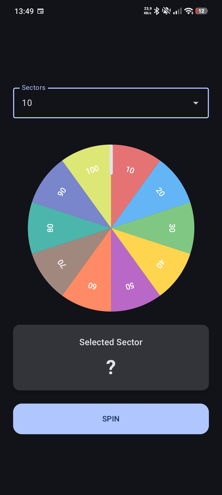
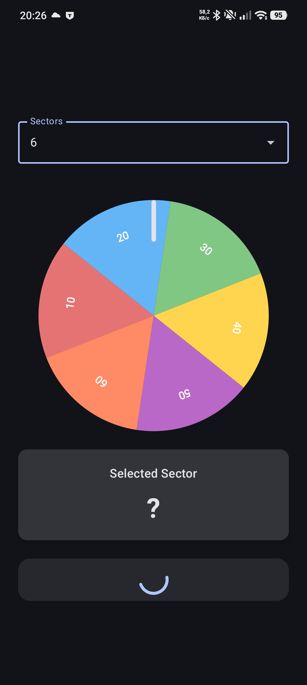
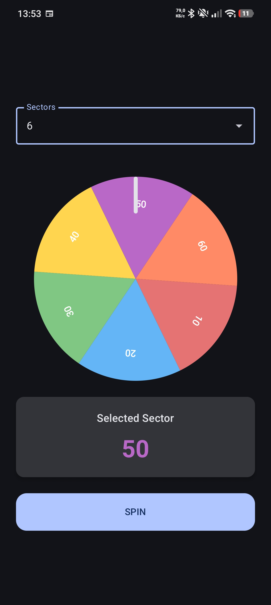

# Roulette

A spinning wheel with numbers or icons. When the wheel stops, the selected value is displayed.  
When wheel rotation is not available (e.g., lack of visual rotation capability), a horizontally
positioned text field or icon moves along an arc.

  

## Features

- Configurable number of sectors
- Random spin generation
- Winner sector calculation
- Smooth deceleration animation
- Adaptive layouts for portrait and landscape orientations
- Custom wheel rendering via Canvas API

## Tech stack

- Kotlin
- Jetpack Compose + Material 3
- MVVM, StateFlow, Unidirectional Data Flow
- Hilt
- Coroutines + Flow
- Animatable API

## Requirements

- Android SDK 26+
- JDK 21
- Android Studio

## Clone Repository

```bash
git clone https://github.com/Juanoff/roulette-android-app.git
```

## Open Project

Open the project in Android Studio.

## Run Application

Run the application on:

- Android Emulator;
- physical Android device.
